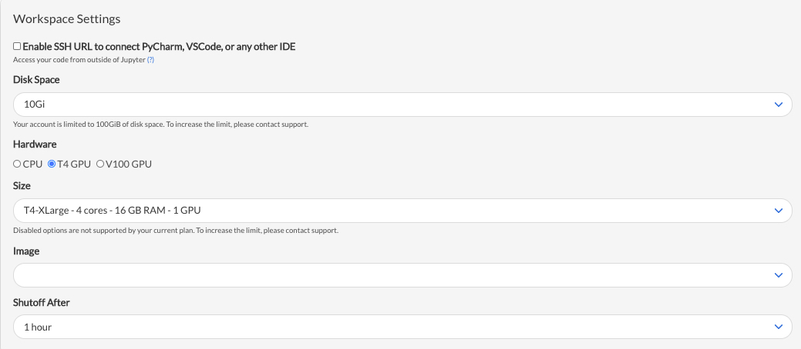

# GPU-Accelerated Deep Learning for Time Series | Learning Lab 53

This is a short demonstration of __GPU-Accelerated Deep Learning for Time Series__ that was part of the presentation, _"The Future of Time Series | Rise of the High-Performance Forecasting System"_. Video and all supporting contents are provided as part of [__Learning Labs PRO, Lab 53__](https://university.business-science.io/p/learning-labs-pro).

- 7 forecasts (Multi-Forecast) were created using a single GluonTS Model
- This is a demonstration of the __scalability__ that can be accomplished as we could implement the same process to forecast 1000's of time series. 

## Code

The code is provided in the `/code` directory:

- `modeltime_test.ipynb` (Jupyter Notebook File) - As demonstrated on the Saturn Cloud Platform
- `modeltime_test.Rmd` (RMarkdown File) - Provided for R-Users that want to run the code locally. Make sure to follow the ["Managing GluonTS Environments" setup instructions here](https://business-science.github.io/modeltime.gluonts/articles/managing-envs.html). 

## Modeltime GluonTS

This presentation showcases `modeltime.gluonts` (an R package used for deep learning forecasting with GluonTS as a forecasting backend). 

- The [Modeltime GluonTS Documentation](https://business-science.github.io/modeltime.gluonts/) can be found here. 
- Modeltime GluonTS is part of the [Modeltime Ecosystem](https://business-science.github.io/modeltime/), a series of R Packages that provide scalable forecasting workflow and infrastructure. 

## GPU Workspace Setup: Saturn Cloud | NVIDIA GPU 

[Saturn Cloud](https://www.saturncloud.io/) enables us to run data science code across multiple machines or with GPUs, then deploy to dashboards, APIs, and scheduled jobs. We used the GPU capability in this lab. 

### Instructions:

- Go to the [SaturnCloud Platform](https://www.saturncloud.io/) to create a GPU Workspace and Modeltime GluonTS Environment 
- Click "Create Project"
- Select the GPU type from the Hardware
- Select the Saturn-R-Modeltime-GPU Image 
    - Pre-built with Modeltime, R Kernel, and supporting R and Python packages
    - The environment uses MXNET CUDA Backend enabling GluonTS to leverage GPUs and greatly speed-up training
    - The result is training times 2X to 5X faster than on a 12-Core Laptop
- Click "Create" - This creates a project
- Once the project is ready, upload the `modeltime_test.ipynb` Jupyter Notebook and run the code. 
- NOTE: Make sure the python path points to the correct python location on the system. 

## Thanks to our Event Sponsors

This event was sponsored by [Saturn Cloud](https://www.saturncloud.io/), [NVIDIA](https://www.nvidia.com/), and [Business Science](https://www.business-science.io/).

